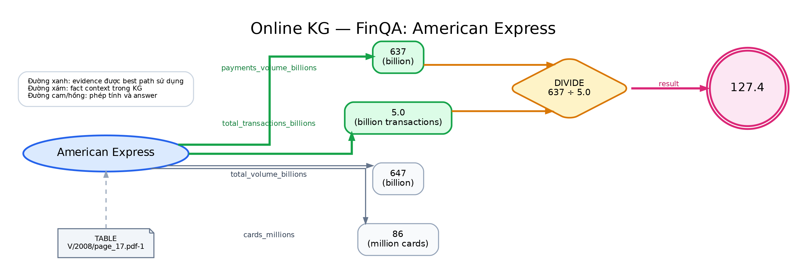

# 1. Mô tả pipeline đầy đủ hiện tại

## 1.1. Mục tiêu

Online-KG RAG trả lời các câu hỏi cần kết hợp thông tin từ nhiều nguồn, đặc biệt là **bảng và văn bản** trong HybridQA. Thay vì đưa toàn bộ dữ liệu vào một prompt duy nhất, hệ thống dựng một đồ thị tri thức tạm thời cho từng câu hỏi, tạo nhiều hướng suy luận, thực thi các hướng đó và chọn câu trả lời có bằng chứng đáng tin cậy nhất.

KG chỉ tồn tại trong quá trình xử lý một câu hỏi. Khi chuyển sang câu hỏi mới, hệ thống dựng KG mới từ context tương ứng. Cách tiếp cận này giới hạn đồ thị vào các thông tin liên quan và giữ được nguồn gốc của từng fact.

## 1.2. Luồng xử lý tổng quát

```text
Câu hỏi HybridQA
        ↓
Bảng oracle + các passage liên kết
        ↓
Truy hồi sơ bộ nội dung liên quan
        ↓
Trích xuất entity, relation và triple
        ↓
Chuẩn hóa entity và relation
        ↓
Dựng Online Knowledge Graph có provenance
        ↓
Sinh nhiều reasoning path
        ↓
Thực thi từng path trên KG
        ↓
Kiểm tra evidence và chấm grounded consistency
        ↓
Chọn path tốt nhất và sinh câu trả lời
```

## 1.3. Bước 1 — Nhận câu hỏi và context

Với mỗi câu hỏi, hệ thống nhận câu hỏi tự nhiên, bảng liên quan, các passage liên kết với bảng và gold answer để đánh giá sau dự đoán. Gold answer không được đưa vào quá trình suy luận.

Hệ thống hiện chạy ở chế độ **oracle-context**: HybridQA cung cấp sẵn bảng đúng. Vì vậy, bài toán hiện tập trung vào đọc bảng, nối bảng với văn bản và reasoning nhiều bước, chưa đánh giá việc tìm bảng trong toàn bộ Wikipedia.

## 1.4. Bước 2 — Truy hồi sơ bộ

Một bảng có thể liên kết tới nhiều passage, trong khi chỉ một số passage cần thiết. Hệ thống dùng BM25 để xếp hạng passage theo câu hỏi và giữ nhóm có điểm cao nhất. Bảng oracle được giữ lại; passage và web snippet, nếu có, được lọc trước khi trích xuất tri thức.

Bước này giảm lượng dữ liệu cần xử lý và giảm số lần gọi LLM.

## 1.5. Bước 3 — Trích xuất entity, relation và triple

LLM đọc từng phần dữ liệu và chuyển nội dung thành triple `(head, relation, tail)`. Ví dụ:

```text
(Karim Bencherifa, birth date, 15 February 1968)
(Karim Bencherifa, nationality, Morocco)
```

Prompt yêu cầu LLM chỉ trả danh sách triple có cấu trúc, không giải thích. Với bảng dài, các dòng được chia thành batch nhỏ để tránh output bị cắt.

Mỗi triple đi kèm provenance gồm loại nguồn (table, text hoặc web), ID nguồn và đoạn nội dung gốc. Vì vậy, hệ thống biết cả fact lẫn nơi fact được lấy ra.

## 1.6. Bước 4 — Chuẩn hóa entity và relation

Các nguồn có thể diễn đạt cùng một thông tin theo nhiều cách. Hệ thống đưa các relation tương đương về tên chung, ví dụ:

```text
hasNationality / country of citizenship / nationality
                         ↓
                    nationality
```

Các entity tương đương cũng được hợp nhất, chẳng hạn `Moroccan → Morocco`, `USA → United States`, hoặc `Cerro Porteño ↔ Club Cerro Porteño`.

Việc chuẩn hóa gồm: chuẩn hóa ký tự; dùng alias/ontology; xử lý biến thể cấu trúc tên; và so khớp tương đồng bảo thủ. Literal ngày tháng và số được bảo vệ để tránh merge sai. Các quyết định merge đều được ghi lại.

## 1.7. Bước 5 — Dựng Online Knowledge Graph

Các triple sau chuẩn hóa được đưa vào một đồ thị có hướng:

- node biểu diễn entity hoặc giá trị;
- edge biểu diễn relation;
- mỗi edge giữ provenance của nguồn tạo ra nó.

Ví dụ:

```text
Karim Bencherifa --birth_date--> 15 February 1968
Karim Bencherifa --nationality--> Morocco
```

Nếu cùng một fact xuất hiện trong table và text, KG giữ được cả hai evidence. Những triple tự nối một entity với chính nó hoặc không có ý nghĩa bị loại.

## 1.8. Bước 6 — Sinh nhiều reasoning path

Từ câu hỏi và KG, LLM sinh nhiều kế hoạch suy luận độc lập. Mỗi path gồm chuỗi mục tiêu nhỏ; bước sau có thể phụ thuộc vào kết quả bước trước.

Ví dụ:

```text
Path 1
  Bước 1: tìm người có ngày sinh 15 February 1968.
  Bước 2: lấy quốc tịch của người đó.

Path 2
  Bước 1: lấy các manager trong bảng.
  Bước 2: kiểm tra ngày sinh của từng manager.
  Bước 3: chọn manager phù hợp và lấy quốc tịch.
```

Sinh nhiều path giúp hệ thống không phụ thuộc hoàn toàn vào một hướng suy luận.

## 1.9. Bước 7 — Sinh code để thực thi và đánh giá path

Đây là thành phần trung tâm nối planner với KG. Reasoning path do planner sinh ra không được chấm điểm chỉ dựa trên mô tả tự nhiên. Với mỗi path, `CodeSynthesizer` gọi LLM để chuyển chuỗi mục tiêu của path thành một chương trình Python nhỏ. Chương trình phải gán kết quả cuối vào biến `result`; giá trị này phải được suy ra từ các lời gọi API của `kg`, không được gán cứng từ câu hỏi hoặc từ kiến thức bên ngoài.

### 1.9.1. Context được đưa vào prompt sinh code

Prompt sinh code gồm câu hỏi, các bước của reasoning path và tài liệu API giới hạn của Online KG. Khi có KG, prompt còn cung cấp danh sách entity, các relation hợp lệ và tối đa 100 edge mẫu. Nhờ đó code generator phải lập trình trên graph cụ thể của câu hỏi thay vì tự nghĩ ra relation hoặc entity không tồn tại.

API công khai cho code sinh gồm:

```python
kg.get_neighbors(entity, relation=None)  # đi từ head tới tail
kg.get_sources(entity, relation=None)     # đi ngược từ tail về head
kg.get_relations(entity)
kg.filter(entities, predicate)
```

Ví dụ, với path “tìm người có ngày sinh rồi lấy quốc tịch”, code có thể thực hiện hai chiều truy vấn:

```python
people = kg.get_sources("15 February 1968", "birth_date")
result = kg.get_neighbors(people[0], "nationality")
```

Điểm quan trọng là code không chỉ mô tả path mà thực sự buộc path phải đi qua các edge đang có trong KG. Với quan hệ ngược, generator phải dùng `get_sources`; dùng `get_neighbors` sai hướng sẽ bị phát hiện trước khi chạy.

### 1.9.2. Kiểm tra và retry code

Code do LLM sinh được kiểm tra theo hai lớp:

1. **Kiểm tra cú pháp và cấu trúc:** code phải compile được, phải có biến `result` và không được rỗng.
2. **Kiểm tra ngữ nghĩa tĩnh:** chỉ chấp nhận các method trong API của KG, giới hạn số lượng và tên keyword, relation literal phải tồn tại trong KG, entity/relation phải dùng đúng hướng cạnh, và không chấp nhận kết quả hard-code trực tiếp hoặc thông qua biến trung gian.

Nếu code sai, lỗi được đưa lại vào prompt cùng code cũ để LLM viết lại. Cơ chế này xử lý các lỗi như `SyntaxError`, dùng keyword không tồn tại (`obj`, `subject`), relation không có trong KG, sai chiều truy vấn hoặc thiếu phép gán `result`. Sau số lần retry cấu hình, path không sinh được code hợp lệ sẽ bị loại khỏi vòng đánh giá.

### 1.9.3. Chạy code trong sandbox và trace evidence

Code hợp lệ được `SandboxExecutor` chạy với biến `kg` là một `TracingKG`, không phải graph thô. Môi trường thực thi chỉ cung cấp một tập built-in an toàn; code không được import module, đọc/ghi file hay gọi mạng. Thời gian chạy cũng bị giới hạn; lỗi runtime và timeout được chuyển thành trạng thái path thất bại thay vì làm dừng toàn pipeline.

Mỗi lần `get_neighbors` hoặc `get_sources` trả về kết quả, `TracingKG` ghi lại evidence/provenance của các edge được truy cập. Kết quả thực thi được đóng gói trong `ExecResult`, gồm:

| Trường | Ý nghĩa |
|---|---|
| `success` | Code có chạy đến cuối hay không |
| `value` | Giá trị của biến `result` |
| `is_empty` | Kết quả rỗng hoặc không có kết quả |
| `error` | Lỗi cú pháp/runtime/timeout nếu có |
| `evidence` | Các `EvidenceRef` của edge đã được truy cập |
| `accessed_edges` | Số lượng evidence/edge được trace |

Vì vậy, một path chỉ được xem là đã thực sự chứng minh answer khi code chạy thành công, trả kết quả không rỗng và để lại lineage evidence trong KG. Đây là khác biệt giữa việc LLM đề xuất một path có vẻ hợp lý và việc path đó được kiểm chứng bằng truy vấn thực thi.

### 1.9.4. Từ kết quả chạy code đến điểm path

Pipeline lưu bộ ba `(reasoning_path, generated_code, ExecResult)` cho từng candidate rồi đưa toàn bộ vào `PathEvaluator`. Evaluator loại ngay các path lỗi, path trả rỗng và path không có evidence. Với path còn lại, điểm được tính từ:

- số nguồn độc lập và số triple khác nhau đã được truy cập;
- provenance của table, text và web;
- bonus khi cùng một answer có hỗ trợ từ cả table và text;
- mức đồng thuận của các path khác cùng trả answer;
- tỷ lệ evidence trực tiếp hỗ trợ output;
- penalty theo độ dài path.

Evaluator cũng phân biệt output được edge hỗ trợ trực tiếp với output số được suy ra từ các edge đã trace. Do đó một path nhiều người đồng thuận nhưng không truy cập được bằng chứng sẽ bị loại, còn path có code ngắn, chạy thành công và có provenance phù hợp sẽ được ưu tiên. Candidate có score cao nhất được chuyển sang `AnswerSynthesizer`, cùng với generated code, kết quả thực thi và evidence đã xác minh.

## 1.10. Bước 8 — Thực thi path trên KG

Mỗi path được chuyển thành một chương trình truy vấn nhỏ. Chương trình chỉ được đọc KG qua các thao tác an toàn như đi từ entity tới giá trị, đi ngược từ giá trị tới entity nguồn, lọc/sắp xếp kết quả và lấy provenance.

Chương trình chạy trong sandbox, không được truy cập file hoặc mạng. Nếu chương trình lỗi, trả rỗng hoặc không truy cập evidence trong KG, path không được xem là lời giải hợp lệ.

Trong khi thực thi, hệ thống ghi lại các edge thực sự được sử dụng. Nhờ đó, answer của mỗi path có thể được đối chiếu với evidence cụ thể.

## 1.11. Bước 9 — Chấm điểm grounded consistency

Phiên bản hiện tại không chỉ đếm số path trả cùng answer. Một path được ưu tiên khi:

- thực thi thành công và kết quả không rỗng;
- answer được nối trực tiếp hoặc suy ra từ các edge đã truy cập;
- có nhiều triple và nhiều nguồn độc lập hỗ trợ;
- có evidence từ cả table và text;
- có nhiều path hợp lệ cùng trả answer đó;
- path đủ ngắn và không dùng quá nhiều evidence không liên quan.

Thứ tự ưu tiên provenance hiện tại:

```text
TABLE + TEXT  >  TEXT only  >  WEB only
```

Nhiều path cùng lặp lại một answer sai sẽ không thắng chỉ nhờ số đông nếu không có evidence. Đây là khác biệt giữa consistency thông thường và grounded consistency.

## 1.12. Bước 10 — Replanning

Nếu tất cả path lỗi, trả rỗng hoặc không có evidence, planner tạo một nhóm reasoning path mới. Quá trình lặp đến giới hạn cấu hình. Nếu vẫn không tìm được path khả thi, hệ thống báo không đủ bằng chứng thay vì tự tạo answer.

## 1.13. Bước 11 — Sinh câu trả lời cuối

Path có grounded score cao nhất được chọn. LLM cuối nhận câu hỏi, kết quả thực thi, tên entity hiển thị phù hợp, evidence triple đã xác minh và lý do path được chọn. Prompt yêu cầu trả lời ngắn gọn, bám đúng kết quả thực thi.

# 2. Các ví dụ điển hình đã sử dụng trong thử nghiệm

## 2.1. Ví dụ 1 — Từ ngày sinh tìm quốc tịch của manager

### Prompt và gold answer

| Nội dung | Giá trị |
|---|---|
| Question ID | `00c4fbc89bffe739` |
| Prompt | What is the nationality of the manager who was born on 15 February 1968? |
| Gold answer | `Morocco` |
| Bảng | List of Mohun Bagan A.C. managers |

Đây là câu hỏi multi-hop: ngày sinh nằm trong passage, trong khi quốc tịch nằm trong bảng manager.

### Dữ liệu chính

Passage:

```text
Karim Bencherifa (born 15 February 1968) is a former Moroccan
football player and currently head coach.
```

Dòng bảng:

| Name | Nationality | From | To |
|---|---|---|---|
| Karim Bencherifa | Morocco | June 2008 | January 2010 |

### Các bước đã chạy

1. **Retrieval:** BM25 xếp passage Karim Bencherifa ở vị trí đầu vì chứa đúng ngày sinh; bảng manager được giữ lại.
2. **Extraction:** passage tạo fact về ngày sinh và nghề nghiệp; bảng tạo fact về nationality và nhiệm kỳ.
3. **Normalization:** `date of birth` được đưa về `birth_date`; `Moroccan` được liên kết với `Morocco`.
4. **KG construction:** Karim Bencherifa trở thành node nối passage và bảng.
5. **Planning:** path trực tiếp gồm hai hop: ngày sinh → manager → nationality.
6. **Execution:** hệ thống đi ngược edge `birth_date` để tìm Karim Bencherifa, rồi đi xuôi edge `nationality` để lấy Morocco.
7. **Evidence scoring:** bước tìm người có text support; bước tìm nationality có table support; answer đồng thời được text mô tả là Moroccan.
8. **Answer:** hệ thống trả `Morocco`, trùng gold.

### Online KG đã tạo

```text
                                    [TEXT]
15 February 1968 <--birth_date-- Karim Bencherifa --current_occupation--> head coach
                                      |
                                      | nationality
                                      v
                                   Morocco
                                [TABLE + TEXT]
                                      |
                                      +--tenure_start--> June 2008
                                      +--tenure_end----> January 2010
```

Các triple cốt lõi:

| Head | Relation | Tail | Nguồn |
|---|---|---|---|
| Karim Bencherifa | birth_date | 15 February 1968 | Text |
| Karim Bencherifa | nationality | Morocco | Table |
| Karim Bencherifa | nationality | Morocco | Text, sau chuẩn hóa |
| Karim Bencherifa | current_occupation | head coach | Text |
| Karim Bencherifa | tenure_start | June 2008 | Table |
| Karim Bencherifa | tenure_end | January 2010 | Table |

Reasoning chain cuối:

```text
15 February 1968
    ← birth_date — Karim Bencherifa
    — nationality → Morocco
```

| Gold | Prediction | Kết quả |
|---|---|---|
| Morocco | Morocco | Đúng |

## 2.2. Ví dụ 2 — Ranking trong bảng rồi tìm tên đệm trong passage

### Prompt và gold answer

| Nội dung | Giá trị |
|---|---|
| Question ID | `00153f694413a536` |
| Prompt | What is the middle name of the player with the second most National Football League career rushing yards? |
| Gold answer | `Jerry` |
| Bảng | List of National Football League career rushing yards leaders |

Câu hỏi yêu cầu chuỗi suy luận:

```text
xác định hạng 2 trong bảng
→ tìm player
→ nối player với passage
→ đọc full name
→ lấy middle name
```

### Dữ liệu chính

| Rank | Player | Career rushing yards |
|---:|---|---:|
| 1 | Emmitt Smith | 18,355 |
| 2 | Walter Payton | 16,726 |
| 3 | Frank Gore | 15,347 |

Passage cần thiết:

```text
Walter Jerry Payton ... was an American professional football player ...
```

### Online KG mục tiêu

```text
Rank 2 --player--> Walter Payton
   |                    |
   |                    +--full_name--> Walter Jerry Payton
   |                    +--played_for--> Chicago Bears
   |
   +--rushing_yards--> 16,726
```

| Head | Relation | Tail | Nguồn |
|---|---|---|---|
| Walter Payton | rank | 2 | Table |
| Walter Payton | rushing_yards | 16,726 | Table |
| Walter Payton | full_name | Walter Jerry Payton | Text |
| Walter Payton | played_for | Chicago Bears | Text/Table |

### Các bước reasoning cần thực hiện

1. Đọc bảng và xác định player ở hạng 2 là Walter Payton.
2. Dùng entity Walter Payton để chọn passage tương ứng.
3. Lấy full name `Walter Jerry Payton` từ passage.
4. Xác định token giữa first name và last name là `Jerry`.
5. Kiểm tra chain đã sử dụng cả table và text trước khi trả answer.

### Kết quả thử nghiệm đã ghi nhận

Case này đã được chạy bằng baseline one-shot để đối chiếu với thiết kế Online-KG. Baseline giữ bảng nhưng chỉ lấy top-5 passage bằng BM25. Passage Walter Payton đứng thứ 6 nên không có trong prompt cuối. Model trả rỗng; Exact Match và F1 đều bằng 0.

Kết quả cho thấy hạn chế của retrieval một lượt: bảng đã xác định Walter Payton nhưng entity trung gian không được dùng để truy hồi passage bước tiếp theo. Đây là case ưu tiên để chạy lại bằng **pipeline đầy đủ có trace**. Báo cáo không coi kết quả baseline này là kết quả full-pipeline.

## 2.3. Ví dụ 3 — Chuẩn hóa entity giữa nhiều nguồn

### Prompt và expected answer

| Nội dung | Giá trị |
|---|---|
| Prompt | Which country is Club Cerro Porteño associated with? |
| Expected answer | `Paraguay` |

Một nguồn dùng `Cerro Porteño`, nguồn khác dùng `Club Cerro Porteño`. Nếu giữ thành hai node, reasoning chain có thể bị đứt.

### KG trước chuẩn hóa

```text
Cerro Porteño ------country------> Paraguay
Club Cerro Porteño --founded-----> 1912
```

### Bước đã chạy

1. Chuẩn hóa ký tự của hai tên.
2. Nhận biết `Club` là designator trong tên câu lạc bộ.
3. Hợp nhất hai node thành một canonical entity.
4. Giữ lại edge từ cả hai nguồn trên cùng entity.
5. Truy vấn relation `country` và nhận `Paraguay`.

### KG sau chuẩn hóa

```text
Club Cerro Porteño --country--> Paraguay
        |
        +--founded--> 1912
```

Đây là kiểm thử trực tiếp entity resolution và KG traversal, không phải benchmark HybridQA end-to-end.

## 2.4. Ví dụ 4 — FinQA: tính payment volume trung bình trên mỗi transaction

### Prompt và gold answer

| Nội dung | Giá trị |
|---|---|
| Example ID | `V/2008/page_17.pdf-1` |
| Prompt | What is the average payment volume per transaction for American Express? |
| Gold program | `637 ÷ 5` |
| Gold answer | `127.4` |
| Display answer | `127.40` |

Đây là câu hỏi số học trên báo cáo tài chính. Hệ thống phải chọn đúng dòng American Express, lấy đúng hai cột và thực hiện phép chia.

### Dữ liệu chính

| Company | Payments Volume (billions) | Total Transactions (billions) |
|---|---:|---:|
| Visa | 2,457 | 50.3 |
| MasterCard | 1,697 | 27.0 |
| American Express | 637 | 5.0 |
| Discover | 102 | 1.6 |

Phép tính cần thực hiện:

```text
Average payment volume per transaction
= Payments Volume / Total Transactions
= 637 / 5.0
= 127.4
```

### Các bước pipeline đã chạy

1. **Nhận context:** adapter FinQA chuyển bảng báo cáo và các câu văn xung quanh thành đầu vào chung của pipeline.
2. **Retrieval:** bảng được giữ lại; các đoạn văn liên quan đến payment network và transaction được xếp hạng.
3. **Extraction:** hệ thống tạo các fact cho từng công ty, trong đó có payment volume và total transactions của American Express.
4. **Normalization:** tên entity trùng được hợp nhất; run ghi nhận hai lexical entity merges.
5. **KG construction:** KG được tạo với 82 nodes, 71 edges và 38 loại relation; không có triple bị loại.
6. **Planning:** ba candidate paths được yêu cầu. Path tốt nhất xác định đúng hai đại lượng của American Express và phép chia cần thực hiện.
7. **Execution:** path lấy `637` từ edge payment volume, lấy `5.0` từ edge total transactions, chuyển hai giá trị về số và tính `637 / 5.0`.
8. **Grounded evaluation:** path có evidence từ các edge đã truy cập, không trả rỗng và được chọn với score `3.75`.
9. **Answer synthesis:** hệ thống trả: “The average payment volume per transaction for American Express is 127.4.”

### Online KG đã tạo

Subgraph trực tiếp phục vụ câu hỏi:

{width=100%}

```text
                              +--payments_volume_billions----> 637
                              |
American Express -------------+--total_transactions_billions-> 5.0
                              |
                              +--total_volume_billions-------> 647
                              |
                              +--cards_millions--------------> 86
```

Các triple cốt lõi:

| Head | Relation | Tail | Nguồn |
|---|---|---|---|
| American Express | payments_volume_billions | 637 | Table |
| American Express | total_transactions_billions | 5.0 | Table |
| American Express | total_volume_billions | 647 | Table |
| American Express | cards_millions | 86 | Table |

Reasoning path được chọn:

```text
American Express
    ├─ payments_volume_billions → 637
    └─ total_transactions_billions → 5.0

637 ÷ 5.0 → 127.4
```

### Đánh giá kết quả

| Tiêu chí | Kết quả |
|---|---|
| Gold numeric answer | 127.4 |
| Executed value | 127.4 |
| Sai số tuyệt đối | 0.0 |
| Execution correctness | Đúng |
| Replan | Không (`0`) |
| Best path | `path_1` |
| Best grounded score | 3.75 |

Về ngữ nghĩa và execution, kết quả trùng hoàn toàn với gold. Tuy nhiên, answer cuối hiện là một câu tự nhiên thay vì chuỗi số thuần. Trước khi chạy evaluator chính thức của FinQA trên toàn bộ tập dữ liệu, cần bổ sung bước lấy numeric answer (`127.4`) từ câu trả lời hoặc cho Answer Synthesizer trả thêm một trường `answer_value` có cấu trúc.

## 2.5. Tổng hợp

| Ví dụ | Kiểu reasoning | Nguồn kết hợp | Kết quả/ý nghĩa |
|---|---|---|---|
| Karim Bencherifa | Ngày sinh → người → quốc tịch | Text + Table | Full pipeline trả đúng Morocco |
| Walter Payton | Hạng 2 → player → full name → middle name | Table + Text | Baseline bỏ passage hạng 6; cần full trace run |
| Cerro Porteño | Hợp nhất biến thể tên → country | Nhiều cách viết entity | Kiểm thử entity resolution trả Paraguay |
| American Express | Chọn hàng/cột → chia hai đại lượng | FinQA Table | Full pipeline thực thi đúng 637 ÷ 5 = 127.4 |

# 3. Kết luận

Pipeline hiện đã bao phủ đầy đủ retrieval, trích xuất tri thức, chuẩn hóa, dựng Online KG, sinh reasoning paths, sinh code truy vấn cho từng path, kiểm tra code, thực thi trong sandbox có trace provenance, chấm điểm theo evidence và sinh answer.

Phần sinh code là cơ chế biến reasoning path thành một phép kiểm chứng có thể chạy được. Nhờ code generator và sandbox, hệ thống không chấp nhận một path chỉ vì mô tả của LLM nghe hợp lý: path phải truy cập được KG, trả kết quả và để lại evidence để evaluator kiểm tra. Các lỗi cú pháp, lỗi API, sai hướng cạnh, hard-code, lỗi runtime và timeout đều được ghi nhận ở cấp path, cho phép loại path hoặc replanning mà không làm hỏng toàn bộ câu hỏi.

Ví dụ Karim Bencherifa cho thấy hệ thống nối được ngày sinh trong text với nationality trong table qua entity chung. Ví dụ Walter Payton cho thấy retrieval một lượt có thể thất bại và lý do cần reasoning có điều kiện theo entity. Ví dụ Cerro Porteño minh họa vai trò của chuẩn hóa entity khi nối facts từ nhiều nguồn. Case American Express cho thấy pipeline cũng thực hiện đúng một phép toán FinQA dựa trên hai fact được lấy từ bảng.

Để các case study tiếp theo có thể đưa trực tiếp vào paper, hệ thống cần lưu full trace của mỗi lần chạy: passage đã truy hồi, triple trước/sau chuẩn hóa, KG, candidate paths, kết quả thực thi, evidence và điểm từng path.
