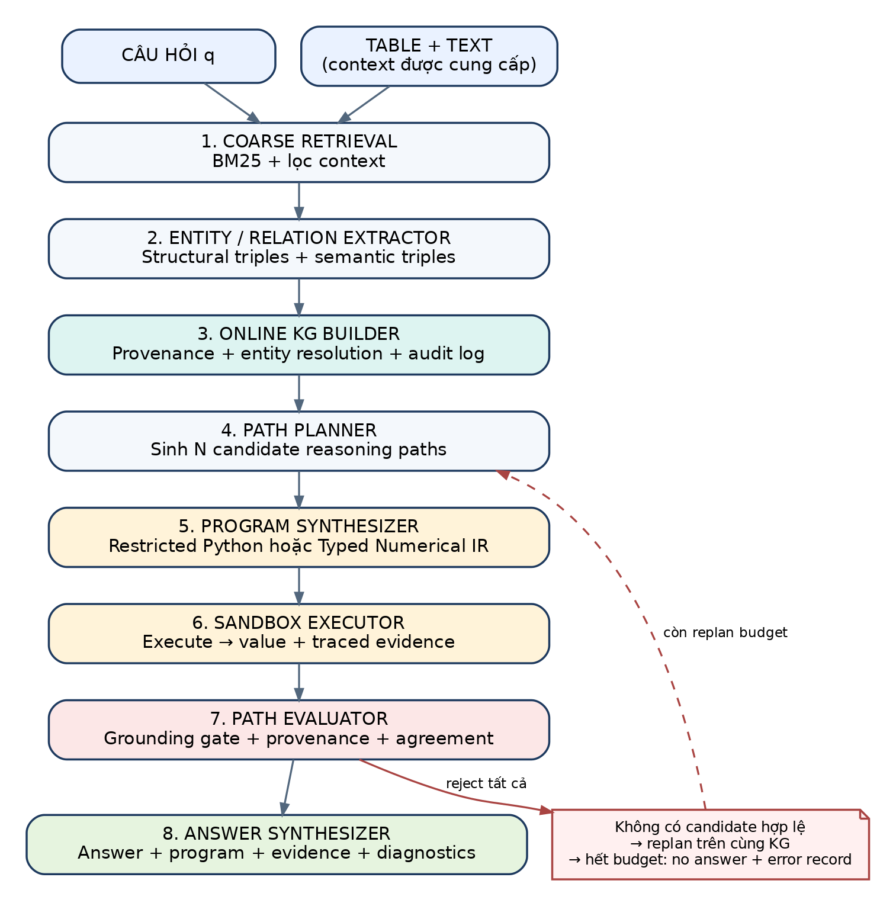
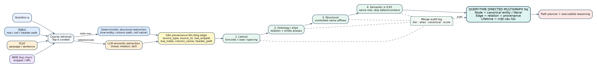
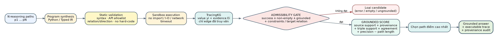
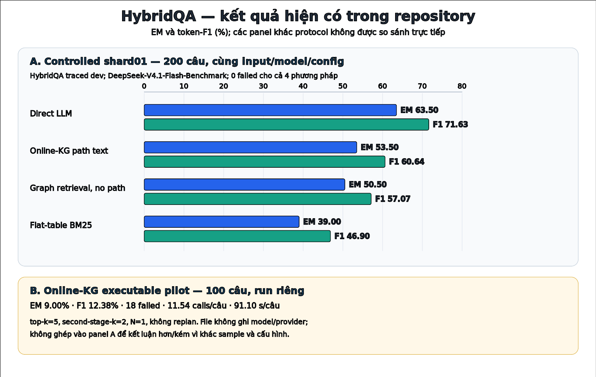
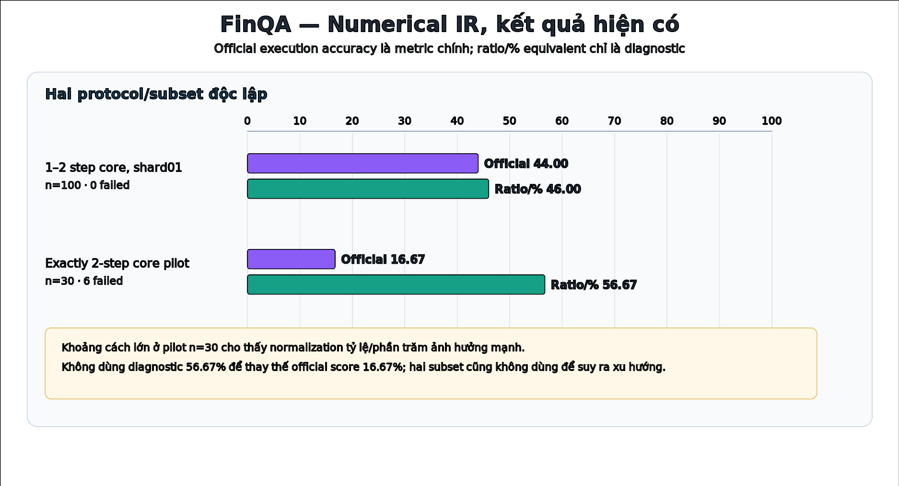

# Tóm tắt điều hành

Hệ thống xây một Knowledge Graph (KG) tạm thời cho **từng câu hỏi** từ table và text, sinh nhiều reasoning path, chuyển từng path thành chương trình có thể thực thi, chạy trong sandbox, rồi chấm path bằng evidence mà chương trình **thực sự truy cập**. Chuỗi kiểm chứng là:

> **Evidence → KG edge có provenance → executable program → execution trace → grounded score → answer**

Thiết kế này nhằm biến evidence rời rạc thành một đường suy luận entity-centric có thể chạy lại và audit. Điểm khác biệt chính so với RAG phẳng là path không được chọn chỉ vì “nghe hợp lý” hoặc vì nhiều path cùng trả một answer. Candidate phải vượt qua cổng thực thi và grounding trước khi agreement được tính như tín hiệu phụ.

Trạng thái benchmark tại commit `9c98d0f`:

- **HybridQA:** đã có kết quả so sánh 4 phương pháp trên cùng shard 200 câu; Direct LLM đạt **63,50 EM / 71,63 F1**, Online-KG path text đạt **53,50 / 60,64**, Graph retrieval no path đạt **50,50 / 57,07**, Flat-table BM25 đạt **39,00 / 46,90**. Full executable Online-KG mới có một pilot riêng 100 câu, **9,00 EM / 12,38 F1**, có 18 failed; run này không cùng sample/config với bảng 200 câu.
- **FinQA:** Numerical IR trên shard 100 câu, chương trình 1–2 bước và bốn toán tử core, đạt **44,00% official execution accuracy** và **46,00% ratio/%-equivalent accuracy**, không có failed example. Pilot 30 câu đúng 2 bước đạt **16,67% official** và **56,67% diagnostic**, có 6 failed.
- Các số trên là **kết quả hiện có**, chưa phải kết quả toàn bộ development split và chưa đủ để đưa ra kết luận cuối cùng về full Online-KG.

# 1. Pipeline tổng thể

{width=75%}

| Bước | Thành phần | Chức năng và đầu ra chính |
|---:|---|---|
| 1 | Coarse Retrieval | Lọc top-k nguồn trước extraction; giữ cấu trúc bảng và chọn passage liên quan. |
| 2 | Entity/Relation Extractor | Sinh structural triples từ bảng và semantic triples từ table/text/web. |
| 3 | Online KG Builder | Gắn provenance, chuẩn hoá relation/entity, hợp nhất thành directed multigraph theo câu hỏi. |
| 4 | Path Planner | Sinh $N$ candidate reasoning paths trên graph vừa dựng. |
| 5 | Program Synthesizer | Chuyển path thành restricted Python hoặc Typed Numerical IR. |
| 6 | Sandbox Executor | Kiểm tra và chạy chương trình với timeout, không import, không file/network I/O. |
| 7 | Path Evaluator | Loại candidate lỗi/rỗng/không grounded; chấm source support, provenance, agreement và precision. |
| 8 | Answer Synthesizer | Trả answer từ executed value của path tốt nhất, kèm evidence và audit diagnostics. |

Replanning là vòng điều khiển phụ: khi không có candidate admissible, planner sinh nhóm path mới trên **cùng KG** cho đến khi hết ngân sách. Khi hết budget, hệ thống trả “không đủ bằng chứng” cùng error record thay vì tự tạo answer.

# 2. Sinh đồ thị tri thức online

## 2.1. Phạm vi và vòng đời

KG được dựng lại từ đầu cho mỗi câu hỏi và chỉ sống trong bộ nhớ trong thời gian xử lý câu hỏi đó. Đầu vào là câu hỏi, bảng được benchmark cung cấp, các passage liên kết và web snippets nếu có. Thiết lập hiện tại dùng **oracle table/context do benchmark cung cấp**, vì vậy chưa đo open-domain table retrieval.

{width=100%}

## 2.2. Hai luồng sinh triple

**Luồng deterministic cho bảng.** Mỗi cell được giữ cùng row entity và đường dẫn header. Với bảng nhiều tầng, column path được ghép từ header cha tới header con, ví dụ:

```text
2002 + Dividend  →  2002_dividend
(March 31, 2002_dividend, .450)
```

Luồng này không phụ thuộc LLM, không bỏ cell và là nguồn chính cho numerical lookup. Nếu LLM enrichment của bảng lỗi, builder vẫn giữ structural triples và ghi `fallback=deterministic_cells`.

**Luồng semantic cho table/text/web.** LLM trích `(head, relation, tail)` để bổ sung các quan hệ khó suy ra chỉ từ vị trí ô, chẳng hạn:

```text
(Karim Bencherifa, birth_date, 15 February 1968)
(Karim Bencherifa, nationality, Morocco)
```

Nếu extraction từ một passage hoặc web snippet lỗi, nguồn đó được bỏ riêng và lỗi được ghi trong `extraction_errors`; toàn pipeline không bị dừng.

## 2.3. Mô hình graph

KG là một **directed multigraph**:

- **Node:** canonical entity hoặc literal sau chuẩn hoá. Bản thân node không giữ thuộc tính nghiệp vụ riêng.
- **Edge:** một triple có hướng `(head) ──relation──▶ (tail)` cùng một hoặc nhiều bản ghi provenance.
- **Multiedge:** cùng một fact có thể xuất hiện ở table và text; hệ thống giữ các evidence độc lập thay vì ghi đè.

Schema provenance tối thiểu:

```yaml
source_type: table | text | web
source_id: table name | passage id | URL
raw_snippet: đoạn gốc sinh ra triple
row_index: chỉ số dòng nếu từ bảng
column_name: tên cột nếu từ bảng
header_path: đường dẫn header nếu từ bảng phân cấp
domain: metadata tuỳ chọn
source_group: metadata tuỳ chọn
```

Đơn vị đếm nguồn độc lập trong evaluator là cặp `(source_type, source_id)`. Nhiều triple cùng một bảng hoặc cùng một passage không được tính thành nhiều nguồn độc lập.

## 2.4. Entity resolution 4 tầng

| Tầng | Quy tắc | Ràng buộc an toàn | Audit |
|---:|---|---|---|
| 1. Lexical | Unicode fold, case fold, dấu câu/khoảng trắng; camelCase → snake_case cho relation | Chỉ gộp exact match sau chuẩn hoá | `tier=lexical`, score 1.0 |
| 2. Ontology/Alias | Alias tường minh như `hasNationality → nationality`, `Moroccan → Morocco` | Chỉ dùng map đã khai báo | `tier=alias`, score 1.0 |
| 3. Structural | Bỏ tiền/hậu tố tổ chức có kiểm soát, ví dụ `Club Cerro Porteño ≡ Cerro Porteño` | Danh sách designator hẹp; không bỏ từ tuỳ ý | `tier=structural`, score 1.0 |
| 4. Semantic | Similarity tối thiểu 0,93 | Chỉ so node cùng vai trò; bỏ literal ngày/số; không merge khi số hoặc modifier phủ định khác nhau | `tier=semantic`, similarity score |

Mọi lần merge lưu `tier`, `alias`, `canonical` và `score`. Ngoài merge đã thực hiện, KG còn lưu query aliases để một cách viết không có designator vẫn tìm được node canonical khi không mơ hồ.

## 2.5. Thuật toán dựng graph rút gọn

```text
Input: question q, retrieved table rows T, passages P, snippets W
Gq ← empty directed multigraph

for each table group t in T:
    register table structure
    add deterministic cell triples(t)
    try add LLM semantic triples(t)
    on error: keep deterministic triples and log fallback

for each passage p in P:
    try add semantic triples(p)
    on error: log and skip p

for each web snippet w in W:
    try add semantic triples(w)
    on error: log and skip w

attach provenance to every edge
resolve entities in lexical → alias → structural → semantic order
return Gq and merge/extraction audit logs
```

Độ phức tạp của bước semantic resolution hiện tại có thành phần so cặp node $O(|V|^2)$ trong trường hợp xấu nhất. Do graph chỉ chứa context đã lọc cho một câu hỏi, phạm vi được giới hạn; tuy nhiên đây vẫn là điểm cần tối ưu khi tăng top-k hoặc dùng bảng lớn.

## 2.6. Ví dụ graph số học đã thực thi

{width=100%}

Ví dụ cho thấy node năm nối tới literal số bằng relation có đơn vị; chương trình truy cập năm giá trị rồi mới gọi toán tử trung bình. Executed answer được tạo từ trace, không được gán cứng trong prompt.

# 3. Path → executable program

## 3.1. Candidate planning

Planner nhận câu hỏi và graph summary để sinh nhiều hướng suy luận. Một path mô tả chuỗi mục tiêu; chương trình hoá biến mô tả đó thành các thao tác cụ thể trên KG. Với câu hỏi quốc tịch qua ngày sinh:

```python
people = kg.get_sources("15 February 1968", "birth_date")
result = kg.get_neighbors(people[0], "nationality")
```

API Python công khai cho code sinh ra bị giới hạn ở các thao tác đọc graph như `get_neighbors`, `get_sources`, `get_relations` và `filter`. Relation literal phải tồn tại trong KG; hướng cạnh sai hoặc hard-code answer bị static validator từ chối.

## 3.2. Typed Numerical IR

Đối với FinQA và câu hỏi số học, Typed Numerical IR cung cấp operator vocabulary đóng. Implementation hiện hỗ trợ:

`lookup`, `const`, `add`, `subtract`, `multiply`, `divide`, `exp`, `greater`, `compare`, `table_sum`, `table_average`, `table_max`, `table_min`, `less`, `negate`, `count`, `range`, `argmax`, `argmin`, các toán tử top-k/k-th, filter và `inclusive_year_count`.

Audit trên annotation FinQA train/dev/public-test cho thấy cả 10 loại gold operator đã phát hành đều có mapping trực tiếp trong IR: `divide`, `subtract`, `add`, `multiply`, `greater`, `table_average`, `table_max`, `table_sum`, `table_min`, `exp`. Operator coverage không đồng nghĩa với program generation accuracy; khó khăn còn lại là chọn đúng operand, thứ tự phép trừ/chia, unit và scale.

## 3.3. Sandbox và execution trace

Mỗi chương trình phải qua hai lớp kiểm tra:

1. **Static validation:** compile/schema hợp lệ, có `result`, chỉ dùng API/operator allowlist, không hard-code answer, relation tồn tại và đúng hướng.
2. **Runtime sandbox:** không import, không file/network I/O, built-ins hạn chế và có timeout.

`TracingKG` bọc quanh graph. Mỗi `get_neighbors`/`get_sources` trả kết quả đồng thời ghi các edge đã truy cập. `ExecResult` lưu `success`, `value`, `is_empty`, `error`, `evidence`, `accessed_edges`, và với IR còn có `step_values` cùng `operator_trace`.

# 4. Grounded Consistency

{width=100%}

## 4.1. Cổng admissibility

Candidate bị gán $-\infty$ và loại nếu xảy ra một trong các điều kiện:

- execution lỗi hoặc timeout;
- output rỗng;
- vi phạm danh sách output được phép hoặc yêu cầu table evidence;
- thiếu evidence của target relation ở các câu hỏi có contract rõ, ví dụ `nationality` hoặc `middle name`;
- không có evidence hoặc output không thể nối với evidence trực tiếp/derived numeric/derived boolean.

Điểm quan trọng: evidence do `TracingKG` ghi khi chạy, không phải danh sách nguồn do LLM tự khai.

## 4.2. Công thức điểm hiện hành

Với output $y$ của candidate $p_i$, đặt:

- $S_y$: tập nguồn độc lập `(source_type, source_id)` của các path hợp lệ cùng trả $y$;
- $T_y$: tập triple khác nhau hỗ trợ $y$;
- $P_y$: tập path hợp lệ trả $y$; $P_{valid}$ là mọi path chạy thành công và không rỗng;
- $L_i$: số bước của path;
- $Precision_i$: tỷ lệ direct evidence trên số edge truy cập; bằng 0,5 với derived numeric/boolean có evidence.

Hàm điểm trong implementation:

$$
Score(p_i) = 4\min\left(\frac{|S_y|}{3}, 1\right)
+ B_{prov}
+ 1.5\min\left(\frac{|T_y|}{4}, 1\right)
+ \frac{|P_y|}{|P_{valid}|}
+ Precision_i
- 0.5L_i
$$

Provenance bonus:

| Evidence có trong nhóm output | Bonus |
|---|---:|
| Table support | +2,00 |
| Text support | +1,00 |
| Web support | +0,25 |
| Có đồng thời table và text | +1,50 thêm |

Do đó riêng thành phần provenance có thứ tự `TABLE + TEXT > TABLE only > TEXT only > WEB only`. Agreement tối đa chỉ đóng góp `+1`, trong khi table + text có thể đóng góp `+4,5` trước cả source/triple support. Nhiều path lặp một lỗi từ một nguồn vì vậy không tự động thắng một path có evidence đa nguồn.

## 4.3. Giới hạn của grounding hiện tại

Execution success và edge access là điều kiện cần, chưa phải bảo đảm đúng ngữ nghĩa. Chương trình vẫn có thể chọn nhầm ô, đảo chiều phép trừ hoặc dùng đúng operator trên sai operands. Với numeric output, derived grounding hiện dùng precision mặc định 0,5 khi có evidence; cần operand-level provenance và typed unit trace để chứng minh chặt chẽ từng toán hạng.

# 5. Benchmark hiện tại

## 5.1. Protocol và nguyên tắc đọc số

| Dataset | Phạm vi hiện tại | Metric chính | Diagnostic | Không được diễn giải như |
|---|---|---|---|---|
| HybridQA | Oracle table + linked passages; BM25 trong context đã cung cấp | Exact Match | Token F1 | Open-domain table retrieval |
| FinQA | Official normalized table + report context | Official execution accuracy, strict 5 decimals | Ratio/%-equivalent execution accuracy | Official program accuracy |

Mỗi bảng chỉ so sánh trực tiếp các hàng có cùng example IDs, model, prompt/decoding và retrieval config. Kết quả từ sample khác nhau được tách riêng.

## 5.2. HybridQA — controlled shard 200 câu

Nguồn: `benchmarks/hybridqa/shard01*.jsonl.summary.json`. Các run dùng cùng 200 example IDs từ traced dev, model `DeepSeek-V4.1-Flash-Benchmark`, `top_k=5`, `second_stage_k=3`, `temperature=0`; không có failed example.

| Phương pháp | n | Failed | EM (%) | F1 (%) | Calls/câu | Latency/câu (s) |
|---|---:|---:|---:|---:|---:|---:|
| Direct LLM | 200 | 0 | **63,50** | **71,63** | 1,00 | 3,62 |
| Online-KG path text | 200 | 0 | 53,50 | 60,64 | 16,43 | 111,78 |
| Graph retrieval, no path | 200 | 0 | 50,50 | 57,07 | 15,39 | 129,33 |
| Flat-table BM25 | 200 | 0 | 39,00 | 46,90 | 1,00 | 7,73 |

{width=100%}

Nhận xét trong phạm vi shard:

- Direct LLM đang là phương pháp có answer accuracy cao nhất và rẻ nhất trong bốn run hoàn tất.
- Path text cao hơn graph retrieval no path **3,0 điểm EM** và **3,58 điểm F1**, gợi ý path representation có ích trên shard này; chưa có paired confidence interval nên không tuyên bố ý nghĩa thống kê.
- Flat-table BM25 thấp nhất, phù hợp với failure mode modality imbalance: top-k phẳng có thể bị passage chiếm hết và làm mất row evidence.
- KG/path methods cần 15–16 calls/câu và 112–129 giây/câu, cao hơn đáng kể so với 1-call baselines. Phần lớn thời gian là LLM latency.

## 5.3. HybridQA — full executable Online-KG pilot 100 câu

Nguồn: `hybridqa-dev-table-text-100-online-kg.jsonl.summary.json`.

| n | Failed | EM (%) | F1 (%) | Calls/câu | Latency/câu (s) | Cấu hình |
|---:|---:|---:|---:|---:|---:|---|
| 100 | 18 | 9,00 | 12,38 | 11,54 | 91,10 | top-k 5; second-stage 2; N=1; no replan |

File run không lưu model/provider và sample không trùng controlled shard 200 câu. Vì vậy số này chỉ dùng để phản ánh trạng thái của executable pipeline ở một pilot cũ; không được đặt ngang hàng để kết luận full Online-KG kém hơn các phương pháp trong bảng 200 câu. Tỷ lệ failed là **18%**, là tín hiệu cần ưu tiên xử lý trước khi chạy full split.

## 5.4. Tiến độ HybridQA 1.500 câu

Fixed set đã được tạo từ `dev.traced.json` với seed 2027: 1.500/3.374 example đủ điều kiện, chia 7 shard × 200 và 1 shard × 100. Phân bố sample gồm 301 answer số và 1.199 answer text; answer-source proxy gồm 254 mixed, 900 passage và 346 table.

Runner chuẩn định nghĩa 6 phương pháp: Direct LLM, Flat-table BM25, Graph retrieval no path, Online-KG path text, Path consistency và full Online-KG. Hiện repository mới có kết quả shard01 cho 4 phương pháp đầu; Path consistency, full Online-KG trên cùng shard và 7 shard còn lại chưa có summary hoàn tất.

## 5.5. FinQA — Numerical IR 100 câu

Nguồn: `finqa-dev-1to2step-core-shard01.jsonl.summary.json`. Đây là shard01 của bộ kiểm soát 500 câu: gold program có 1–2 bước và chỉ dùng `add`, `subtract`, `multiply`, `divide`. Shard gồm 62 câu một bước, 38 câu hai bước; evidence modality gồm 60 table-only, 24 text-only và 16 both.

| Chỉ số | Kết quả |
|---|---:|
| Số câu / failed | 100 / 0 |
| **Official execution accuracy** | **44,00%** |
| Ratio/%-equivalent execution accuracy | 46,00% |
| IR parse rate | 73,50% |
| Schema validity rate | 73,50% |
| Execution success rate | 72,83% |
| Operator accuracy | 63,47% |
| Step accuracy | 56,25% |
| Grounding precision / recall | 64,55% / 58,96% |
| Calls/câu | 10,67 |
| Latency/câu | 98,78 s |

Error taxonomy trên 54 câu không đạt execution accuracy:

| Nhóm lỗi | Số lượng | Tỷ trọng trong 54 lỗi |
|---|---:|---:|
| Serialization/schema | 26 | 48,15% |
| Operand hoặc operator selection | 10 | 18,52% |
| Operator selection | 7 | 12,96% |
| Unit/scale hoặc chưa phân loại | 5 | 9,26% |
| Grounding | 5 | 9,26% |
| Operand selection | 1 | 1,85% |

Ưu tiên kỹ thuật rõ nhất là tăng parse/schema validity: gần một nửa số lỗi hiện thuộc serialization/schema. Sau đó là chọn operator/operand và grounding.

## 5.6. FinQA — pilot đúng 2 bước, 30 câu

| Chỉ số | Kết quả |
|---|---:|
| Số câu / failed | 30 / 6 |
| **Official execution accuracy** | **16,67%** |
| Ratio/%-equivalent execution accuracy | 56,67% |
| IR parse/schema/execution success rate | 68,89% |
| Operator accuracy | 60,32% |
| Step accuracy | 50,79% |
| Grounding precision / recall | 75,56% / 65,56% |
| Calls/câu | 14,37 |
| Latency/câu | 856,41 s |

{width=100%}

Khoảng cách lớn giữa official và ratio/% diagnostic ở pilot 30 câu cho thấy answer scaling/normalization ảnh hưởng mạnh. Theo protocol, **16,67% official** mới là số chính; 56,67% chỉ giúp chẩn đoán dạng biểu diễn ratio so với percentage. Pilot này cũng có latency bất thường cao và 20% failed, vì vậy không dùng nó để suy ra xu hướng so với run 100 câu.

# 6. Kết luận có thể rút ra ở thời điểm hiện tại

1. Pipeline đã có đủ các thành phần cốt lõi: query-time KG, provenance, entity resolution có audit, path/program synthesis, sandbox execution, evidence tracing và grounded evaluator.
2. Trên HybridQA shard 200 câu, Direct LLM đang dẫn đầu về cả accuracy và chi phí. Các graph/path methods chưa chứng minh được lợi thế answer accuracy, dù tạo được trace và audit tốt hơn.
3. Full executable Online-KG chưa có matched run đủ để so sánh công bằng trên HybridQA. Pilot 100 câu cho thấy failure rate cao và cần hardening trước khi mở rộng.
4. FinQA Numerical IR đạt 44% official execution accuracy trên controlled shard 100 câu; bottleneck lớn nhất là serialization/schema, sau đó là program selection và grounding.
5. Kết quả hiện tại chưa hỗ trợ claim “state of the art”, chưa hỗ trợ claim tổng quát trên toàn dev split, và chưa đo open-domain retrieval.

# 7. Benchmark cần hoàn tất tiếp

Ưu tiên theo thứ tự:

1. Hoàn tất `path_consistency` và `online_kg` trên chính HybridQA shard01 200 câu để có matched comparison.
2. Chạy đủ 8 shard × 6 phương pháp của HybridQA 1.500, giữ nguyên model, prompt, decoding và retrieval config.
3. Chạy đủ 5 shard FinQA 1–2 step core (500 câu), sau đó mở rộng sang full fixed dev khi pipeline ổn định.
4. Thêm retry/repair cho IR serialization nhưng chỉ sửa wrapper/schema không mơ hồ; không tự chọn operator hoặc operand thay model.
5. Báo paired bootstrap confidence interval trên cùng example IDs; tách failed rate, mean/median/p95 latency và logical calls.
6. Thực hiện ablation: no second stage, no bridge query, no structural triples, deterministic-only, semantic-only, agreement-only và grounded provenance selector.
7. Thêm operand-level provenance, unit conversion trace và contradiction check trước khi đưa claim về numerical grounding.

# 8. Artefact và khả năng tái lập

Các số trong báo cáo được lấy trực tiếp từ các summary đã lưu trong repository, không nội suy từ case study:

- HybridQA matched 200: `benchmarks/hybridqa/shard01*.jsonl.summary.json`.
- HybridQA executable pilot 100: `benchmarks/hybridqa/hybridqa-dev-table-text-100-online-kg.jsonl.summary.json`.
- FinQA controlled 100: `benchmarks/finqa/finqa-dev-1to2step-core-shard01.jsonl.summary.json`.
- FinQA 2-step pilot 30: `benchmarks/finqa/finqa-dev-2step-core-30-numerical-ir.jsonl.summary.json`.
- Sampling manifests: các file `*.distribution.json` cùng thư mục.

Mốc mã nguồn dùng để lập báo cáo: commit `9c98d0f`, ngày 22/09/2026. Khi cập nhật kết quả, cần lưu model identifier, commit hash, prompt/config, exact input split, completed/failed count và provider usage thật. Không quy đổi ký tự prompt thành token nếu provider không trả usage.

